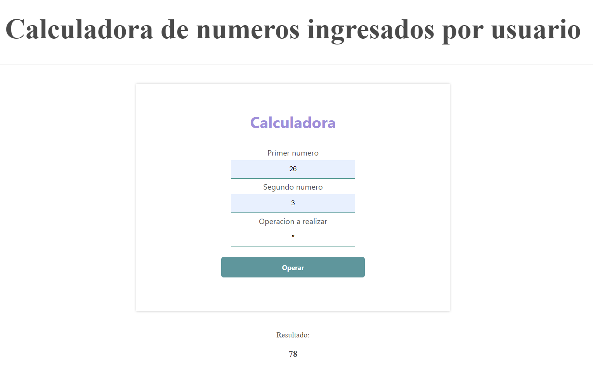
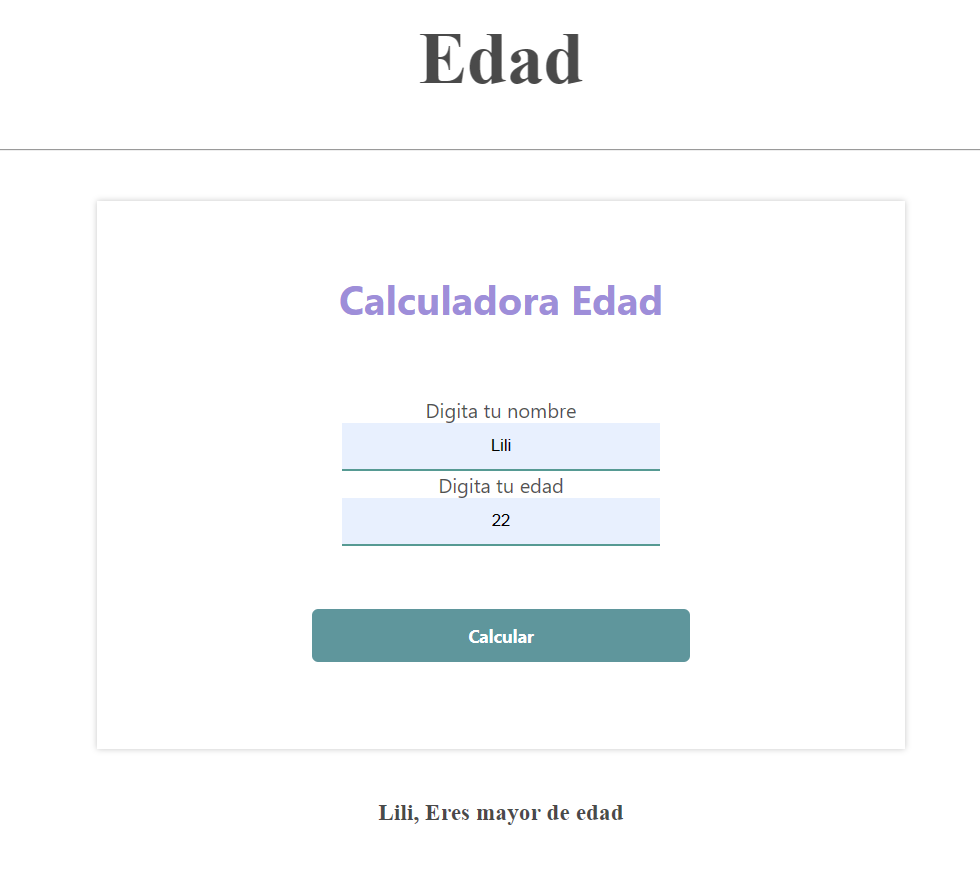
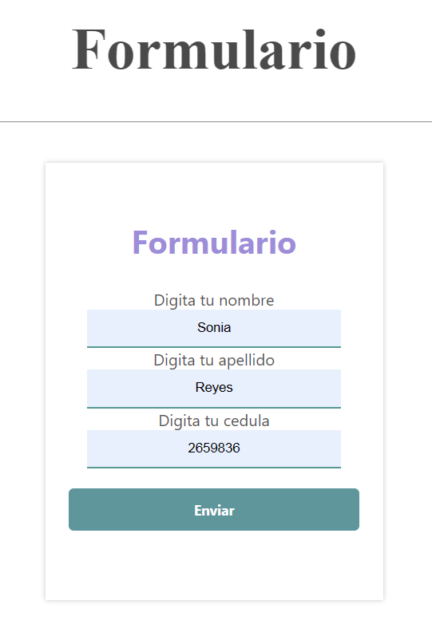
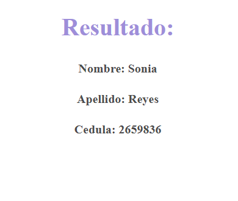
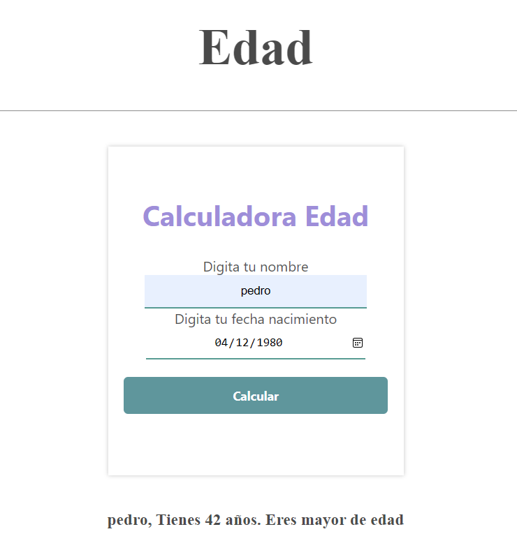
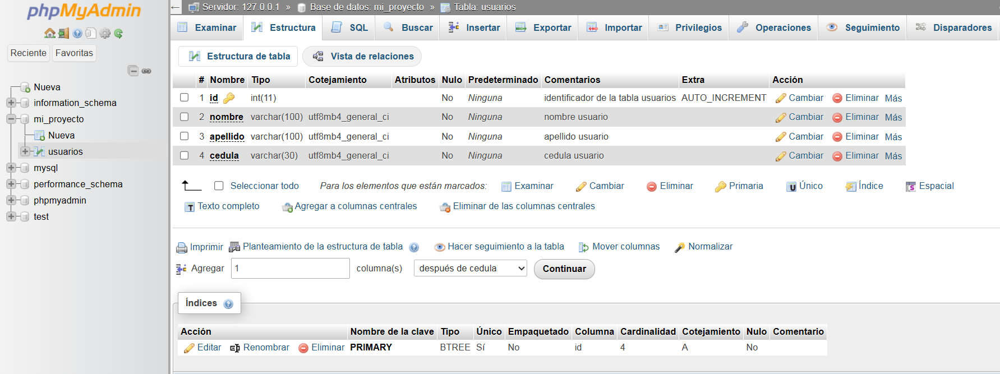
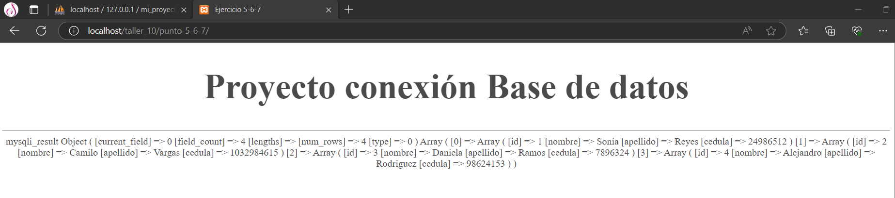
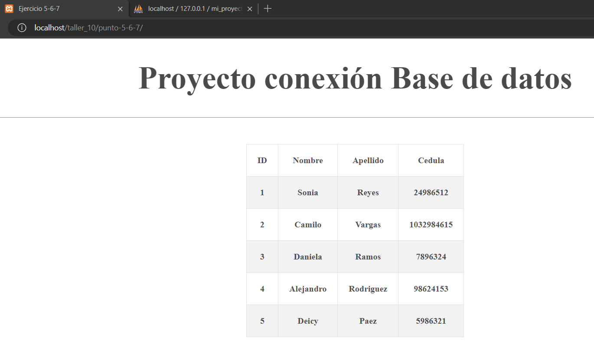

<h1>Taller 10 Sonia Reyes</h1>

<h2>Información</h2>

Full Stack Básico - Grupo 1

Docente: Cristian Patiño

<h2>Punto 1: Operación de dos números</h2>

<h2>Punto 2: Calculo de Mayoría de Edad</h2>

<h2>Punto 3: Paso de datos del usuario </h2>

<h2>Punto 4: Calculo de Mayoría de Edad con Fechas</h2>

<h2>Punto 5-6-7: Proyecto conexión Base de datos</h2>
<h3>5: Base de datos</h3>

<h3>6: Conexión</h3>

<h3>7: Muestra de datos en pantalla</h3>

<h2>Punto 9: </h2>

<h2>Punto 10: </h2>

<h2>Punto 11: </h2>

<h2>Punto 12: </h2>

<h6>Trabajo desarrollado por SR.</h6>